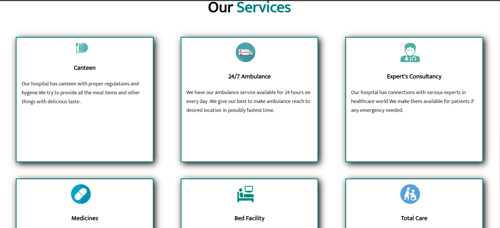
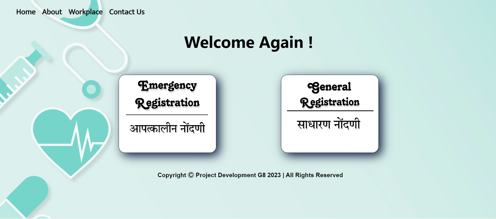
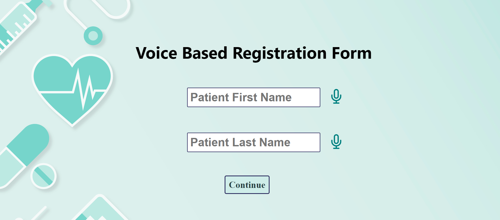
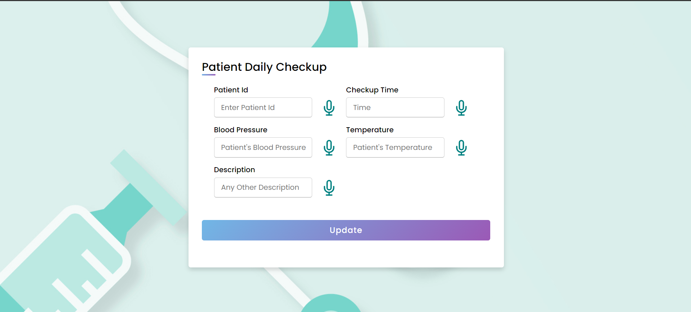

# EchoCare - Voice-Based Patient Registration System

Welcome to EchoCare - Transforming patient registration through the simplicity of voice! 🗣️🏥

EchoCare is an innovative voice-based patient registration system designed to streamline and enhance the patient onboarding process. Crafted with HTML, CSS, JavaScript, Bootstrap, and jQuery for the frontend, and powered by Node.js, Express.js, MongoDB, NLP, and ML algorithms in the backend, this project leverages a comprehensive tech stack to redefine healthcare interactions. Join us in revolutionizing patient care through the seamless integration of voice technology.

## Key Features

- **Voice-Based Registration:** Patients can register seamlessly using their voice, reducing the need for manual data entry.

- **HTML, CSS, JavaScript, Bootstrap, jQuery:** The frontend is built using a combination of these technologies for a robust and user-friendly experience.

- **Node.js, Express.js, MongoDB:** The backend is powered by Node.js and Express.js for server-side operations, and MongoDB for secure and efficient data storage.

- **NLP and ML Algorithms:** Incorporating Natural Language Processing and machine learning algorithms to understand and process voice inputs accurately.

- ## Screenshots
- 

- 

- 

- 

- 

- 

- 

## Technologies Used

### Frontend
- **HTML, CSS, JavaScript:** Core technologies for building the frontend interface.
- **Bootstrap:** Frontend framework for a responsive and visually appealing design.
- **jQuery:** Simplifying DOM manipulation and enhancing interactivity.

### Backend
- **Node.js, Express.js:** Backend technologies for handling server-side operations.
- **MongoDB:** Database for storing patient information securely.
- **NLP and ML Algorithms:** Leveraging advanced algorithms to enhance voice recognition capabilities.

## Contribution

Contributions are welcome! If you'd like to enhance EchoCare, add new features, or suggest improvements, feel free to open a pull request or submit an issue.
